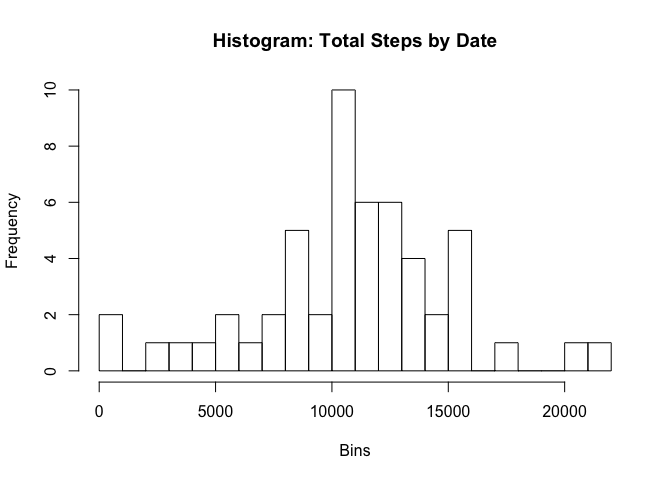
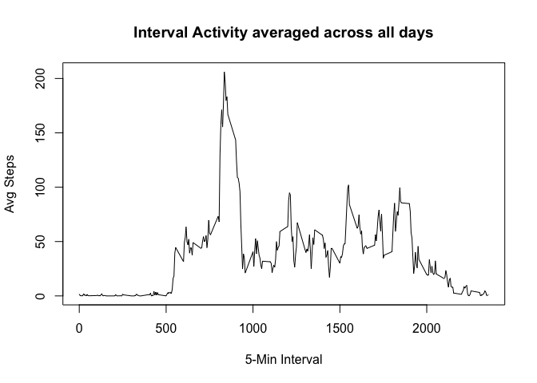
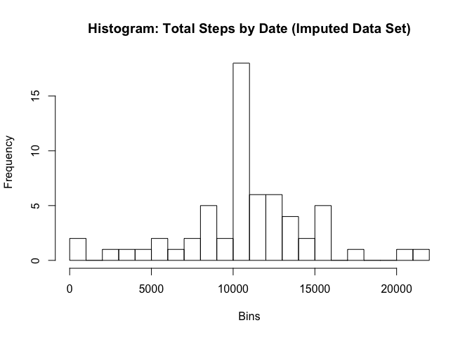
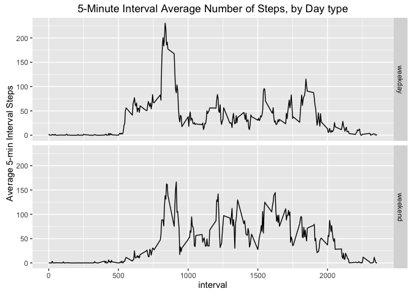

# Reproducible Research: Peer Assessment 1


## Loading and preprocessing the data
Set the working directory for the project.  

```r
setwd("~/datasciencecoursera/RepData_PeerAssessment1")
```
Load the Activity data:

```r
data<-read.csv("activity.csv", header=T, stringsAsFactors = F)
str(data)
```

```
## 'data.frame':	17568 obs. of  3 variables:
##  $ steps   : int  NA NA NA NA NA NA NA NA NA NA ...
##  $ date    : chr  "2012-10-01" "2012-10-01" "2012-10-01" "2012-10-01" ...
##  $ interval: int  0 5 10 15 20 25 30 35 40 45 ...
```
Transform the date variable from character to a proper Date type:

```r
data$date<-as.Date(data$date, format="%Y-%m-%d")
str(data)
```

```
## 'data.frame':	17568 obs. of  3 variables:
##  $ steps   : int  NA NA NA NA NA NA NA NA NA NA ...
##  $ date    : Date, format: "2012-10-01" "2012-10-01" ...
##  $ interval: int  0 5 10 15 20 25 30 35 40 45 ...
```
Search for missing values in the numeric column and filter out rows with missing data:

```r
table(is.na(data$steps))
```

```
## 
## FALSE  TRUE 
## 15264  2304
```

```r
#Filter out the missing data:
data_NoNa<-data[complete.cases(data),]
nCompleteCases<-nrow(data_NoNa)
```
The number of complete rows in the data subset that does not contain missing values is:

```r
nCompleteCases
```

```
## [1] 15264
```

Preview of data rows in the clean data set:

```r
head(data_NoNa, 15)
```

```
##     steps       date interval
## 289     0 2012-10-02        0
## 290     0 2012-10-02        5
## 291     0 2012-10-02       10
## 292     0 2012-10-02       15
## 293     0 2012-10-02       20
## 294     0 2012-10-02       25
## 295     0 2012-10-02       30
## 296     0 2012-10-02       35
## 297     0 2012-10-02       40
## 298     0 2012-10-02       45
## 299     0 2012-10-02       50
## 300     0 2012-10-02       55
## 301     0 2012-10-02      100
## 302     0 2012-10-02      105
## 303     0 2012-10-02      110
```
## What is mean total number of steps taken per day?
### Total number of steps taken per day:

```r
library(dplyr)
TotalStepsByDate<- data_NoNa %>% group_by(date) %>% summarize(totalSteps = sum(steps))
```
Histogram of Total Number of Steps taken:

```r
hist(TotalStepsByDate$totalSteps, breaks=30, xlab="Bins", main="Histogram: Total Steps by Date")
```



### Mean of the Total Number of Steps take by day:

```r
mean(TotalStepsByDate$totalSteps)
```

```
## [1] 10766.19
```

### Median of the Total Number of Steps take by day:

```r
median(TotalStepsByDate$totalSteps)
```

```
## [1] 10765
```
## What is the average daily activity pattern?
Average the steps taken by interval across all days:

```r
AvgStepsByInterval<- data_NoNa %>% group_by(interval) %>% summarize(avgSteps=mean(steps))
plot(AvgStepsByInterval$interval, AvgStepsByInterval$avgSteps, type="l", xlab="5-Min Interval", ylab="Avg Steps", main="Interval Activity averaged across all days")
```



The 5-minute interval, across all days, with the maximum number of steps is: interval **835**

```r
AvgStepsByInterval[which.max(AvgStepsByInterval$avgSteps),]
```

```
## Source: local data frame [1 x 2]
## 
##   interval avgSteps
##      (int)    (dbl)
## 1      835 206.1698
```

## Imputing missing values
The original Activity data set had **2304** missing values in the step variable.
We will fill out the missing values by calculating and assigning the 5-minute interval average number of steps taken across all days, based on the 5-minute interval associated with the missing value.

```r
Lookup_AvgStepsByInterval<- data_NoNa %>% group_by(interval) %>% summarize(avgSteps=mean(steps))
imputedValuesDataset <- data 
for (i in 1:nrow(imputedValuesDataset)) {
  if (is.na(imputedValuesDataset$steps[i])) {
    imputedValuesDataset$steps[i] <- Lookup_AvgStepsByInterval[which(imputedValuesDataset$interval[i] == Lookup_AvgStepsByInterval$interval), ]$avgSteps
  }
}
```

A preview of the new data set with imputed values is shown below:

```r
head(imputedValuesDataset, 10)
```

```
##        steps       date interval
## 1  1.7169811 2012-10-01        0
## 2  0.3396226 2012-10-01        5
## 3  0.1320755 2012-10-01       10
## 4  0.1509434 2012-10-01       15
## 5  0.0754717 2012-10-01       20
## 6  2.0943396 2012-10-01       25
## 7  0.5283019 2012-10-01       30
## 8  0.8679245 2012-10-01       35
## 9  0.0000000 2012-10-01       40
## 10 1.4716981 2012-10-01       45
```

Summarize the new Total Number of Steps taken, grouped by day:

```r
newTotalStepsByDate<- imputedValuesDataset %>% group_by(date) %>% summarize(totalSteps = sum(steps))
head(newTotalStepsByDate, 10)
```

```
## Source: local data frame [10 x 2]
## 
##          date totalSteps
##        (date)      (dbl)
## 1  2012-10-01   10766.19
## 2  2012-10-02     126.00
## 3  2012-10-03   11352.00
## 4  2012-10-04   12116.00
## 5  2012-10-05   13294.00
## 6  2012-10-06   15420.00
## 7  2012-10-07   11015.00
## 8  2012-10-08   10766.19
## 9  2012-10-09   12811.00
## 10 2012-10-10    9900.00
```

Create the histogram of the new Total Number of steps taken (data set with imputed values)

```r
hist(newTotalStepsByDate$totalSteps, breaks=30, xlab="Bins", main="Histogram: Total Steps by Date (Imputed Data Set)")
```



The new mean of the filled data set is:

```r
mean(newTotalStepsByDate$totalSteps)
```

```
## [1] 10766.19
```

The mean of the filled data set without missing values was:

```r
mean(TotalStepsByDate$totalSteps)
```

```
## [1] 10766.19
```

The means are the same.
     
The new median of the filled data set is:

```r
median(newTotalStepsByDate$totalSteps)
```

```
## [1] 10766.19
```

The median of the data set without missing values was:

```r
median(TotalStepsByDate$totalSteps)
```

```
## [1] 10765
```

The median of the data set with imputed values is slightly bigger.

## Are there differences in activity patterns between weekdays and weekends?
Define a function that will calculate is a date is a weekday or a weekend day.


```r
determineWeekdayFromWeekend<-function(aDate){
  if( tolower(weekdays(aDate)) %in% c("monday", "tuesday", "wednesday","thursday","friday")) return("weekday")
  if( tolower(weekdays(aDate)) %in% c("saturday", "sunday")) return("weekend")
}
```

Create a new Factor varible in the filled data set that classifies a Date as weekday or weekend:

```r
imputedValuesDataset$dayType<-as.factor(sapply(imputedValuesDataset$date, determineWeekdayFromWeekend))
```

Calculate the average number of steps taken by 5-minute interval, grouped by weekday or weekend:

```r
fiveMinAvgStepsByWeekendOrWeekday<-imputedValuesDataset%>%group_by(dayType,interval)%>% summarize(avgSteps=mean(steps))
str(fiveMinAvgStepsByWeekendOrWeekday)
```

```
## Classes 'grouped_df', 'tbl_df', 'tbl' and 'data.frame':	576 obs. of  3 variables:
##  $ dayType : Factor w/ 2 levels "weekday","weekend": 1 1 1 1 1 1 1 1 1 1 ...
##  $ interval: int  0 5 10 15 20 25 30 35 40 45 ...
##  $ avgSteps: num  2.251 0.445 0.173 0.198 0.099 ...
##  - attr(*, "vars")=List of 1
##   ..$ : symbol dayType
##  - attr(*, "drop")= logi TRUE
```

Plot the aggregation

```r
library(ggplot2)

ggplot(fiveMinAvgStepsByWeekendOrWeekday, aes(interval, avgSteps))+
    geom_line()+
    facet_grid(dayType~.)+
    ggtitle("5-Minute Interval Average Number of Steps, by Day type")+
    ylab("Average 5-min Interval Steps")
```




>Prepared by etsibert@hotmail.com, 03/06/2016


